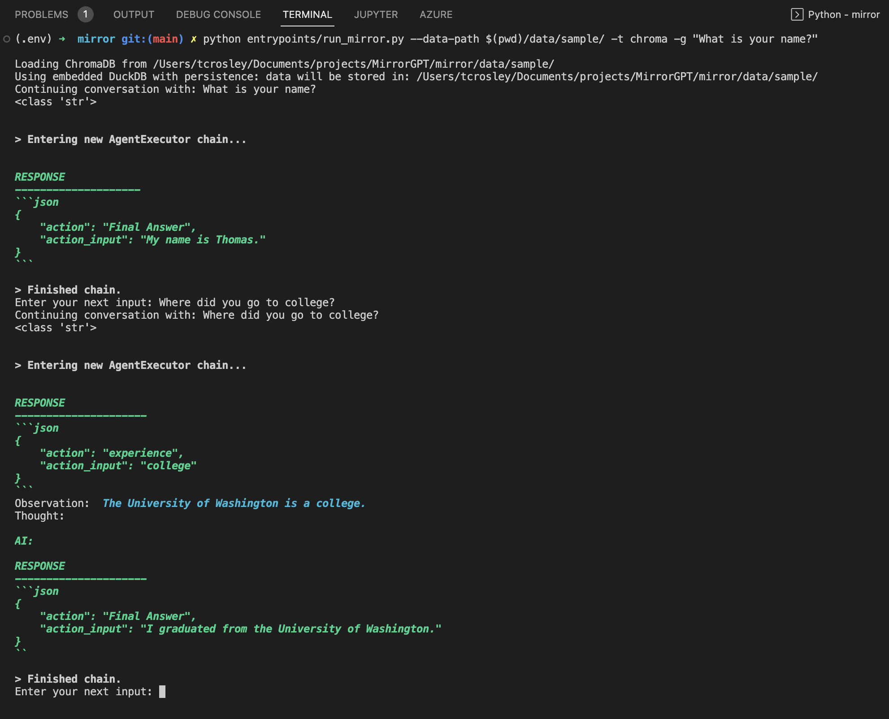

# 🪞 MirrorGPT 🪞
A set of tools for building a personalized agent that mirrors you - the facts about you, your speaking style, the sound of your voice, and more.

Solving the *personal* AI alignment problem

## Overview 
This project builds a set of tools to build a Mirror Agent of yourself - an AI-based agent that tries to represent your preferences, act as you would, speak in your style, and more.


**Subject**: the human our agent is trying to emulate <br>
**Mirror**: the agent that is "mirroring" the human subject

With this project you can:
1. Create a Mirror Model
2. Interact with the Mirror
3. [Coming Soon] Integrate the Mirror into other applications

## Quickstart

### Setup

```
git clone git@github.com:crosleythomas/MirrorGPT.git
cd MirrorGPT
mkdir mirror/data/local

# Set up python virtual environment
python3 -m venv .env
source .env/bin/active
pip install -e .

cd mirror
pip3 install -r requirements.txt


# Add your private config
cp config/.env.template config/.env
# Then open config/.env and edit value as appropriate
# For example, add your OpenAI API key
```

### Load an Existing Mirror
If you want to interact with a Mirror Agent before creating your own, you can load some data for a pre-set Mirror.

```
python entrypoints/run_mirror.py --data-path $(pwd)/data/sample/ -t chroma -g "What is your name?"
```

This will start a conversation with you asking the mirror "What is your name?". The only data loaded in for this mirror is its professional experience, so you can ask it questions like "Where did you go to college?" or "What do you do for work?".



### Create Your Mirror
Now, let's get your own Mirror set up.

The most basic Mirror Agent design is to use an existing base model that is prompted to pull relevant facts about you from a data store when needed. To create this for yourself, start by pulling in some data about yourself. In the setup instructions you created a folder under `mirror/data/local`. This folder is added to the gitignore so you can store personal information in here, or create a folder outside of this project if you would prefer.

Creating your Mirror Dataset happens in 3 ETL steps:

<b>Step 1: Extract</b><br>
The script in [extract.py](mirror/data/extract/extract.py) can pull data from URLs or local files and turn them into text using [UnstructuredIO](https://github.com/Unstructured-IO/unstructured). `extract.py` can pull the data in addition to turning it into text, but in some cases it's easier to just pull the data manually and then use `extract.py` for the extraction.

LinkedIn is a fun place to start, but blocks scripted GET requests to profiles. To use LinkedIn data in this example, I'd recommend just going to your profile, clicking "More", selecting "Save to PDF", and saving that PDF in your local data folder.

Then use the extract script on the exported PDF.
```
python data/extract/extract.py -s <path_to_pdf> -t file -o data/local/extracted/linkedin.txt
```

<b>Step 2: Transform</b><br>
Transform any unstructured text document into data that is more usable by your Mirror Agent. The initial implementation of this Transformation process turns a text document into a series of concrete statements about you, e.g. "Attended the University of Washington."
```
python data/transform/transform.py -i data/local/extracted/linkedin.txt -o data/local/transformed/linkedin.txt -t statements
```

<b>Step 3: Load</b>
The load step loads that transformed data into a data store that your Mirror Agent can use as a Tool.
```
python data/load/load.py -i data/local/transformed/linkedin.txt -d chromalocal
```


<b>Run Your Mirror!</b>
That was all you need to run your Mirror with the same command as [above](#load-an-existing-mirror) pointing to your local data.
```
python entrypoints/run_mirror.py --data-path data/local/ -g "Hi what's your name?" -t chroma
```

To continue improving your Mirror, continue adding more data and customizing the MirrorAgent behavior
- [Adding data sources](mirror/data/README.md)
- [Customizing MirrorAgent behavior](mirror/mirror_agent/README.md)

### Giving Your Mirror a Voice
To make your Mirror feel even more personalized, you can use [ElevenLabs](https://beta.elevenlabs.io/) to create a Voice Clone and integrate it with your mirror.

It takes only four steps:
1. Create an account on https://beta.elevenlabs.io/ 
2. Add your ElevenLabs API key to [.env](config/.env) as `ELEVENLABS_API_KEY`
3. Run [voice/create.py](voice/create_voice.py) to create sample audio and a custom voice
4. Copy the voice_id output from `create_voice.py` into `.env` as `ELEVENLABS_VOICE_ID` or passing that ID as an argument into the relevant script

Now you can request a speech response when running your Mirror.
```
python entrypoints/run_mirror.py --data-path data/local 
```

## Architecture Outline
Under the hood, here is the architecture behind the current version of Mirror.

< image >

The north star vision (which we hope you contribute to!) looks like the following:

< image >

## Personalization Types

| Data Type | Example | Personalization Aspect | Storage Location |
|-------------|---------|------------------------|------------------|
|Conversational Text|Transcript of conversation between Subject and another person|Speaking style |Vector database, flat files, or blob storage|
|Concrete Facts|Is gluten-free?|Factual accuracy|Vector store|
|Speech Data|Sound of voice|TTS Voice Sound|Object Storage|

## Design Principles
1. **Privacy** - mirroring individual humans can become very privacy sensitive, depending on what the user wants to share with their Mirror. This project is set up with local databses to keep all data locally and while train custom models locally in the future.
2. **Adaptability** - everything in LLM/FM-world is moving incredibly fast. Keep everything as generic as possible. Example: store the raw conversations between InterviewAgent and the subject, even if the current Mirror logic uses a summarized set of facts gathered by the InterviewAgent. A later update may extract information from the original conversation in a different way and we will want to apply that retroactively.
3. **Simplicity** - open source projects should be easy to run (there's a lot of projects to choose between!) and onboard onto (e.g. VS Code Dev Container setup)
4. **Extensibility** - it should be easy to add other types of personalization to the Mirror. For example, we are starting with chat-based personalization, but we should design with extensions like voice and video personalization in mind.

## Creating Your Mirror

## Training
There are two major components to training a Mirror Model
1. Accumulating a set of facts about the Subject
2. Fine-tuning a foundational language model with 

## Roadmap
- [X] Seeding fact database from external sources
- [X] Text-to-speech mirroring integration - e.g. [YouTube <> Deepfake](https://twitter.com/aleemrehmtulla/status/1644728115032207367)
- [ ] InterviewAgent storing facts + MirrorAgent generating with DB lookups
- [ ] Fine-tuning foundation models for custom Mirror model
- [ ] Face mirroring integration - e.g. [Ziva Dynamics](https://zivadynamics.com/)

## Contributing
Please see [CONTRIBUTING.md](CONTRIBUTING.md)
