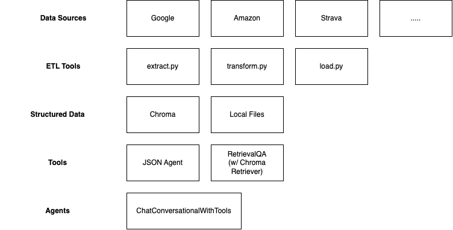
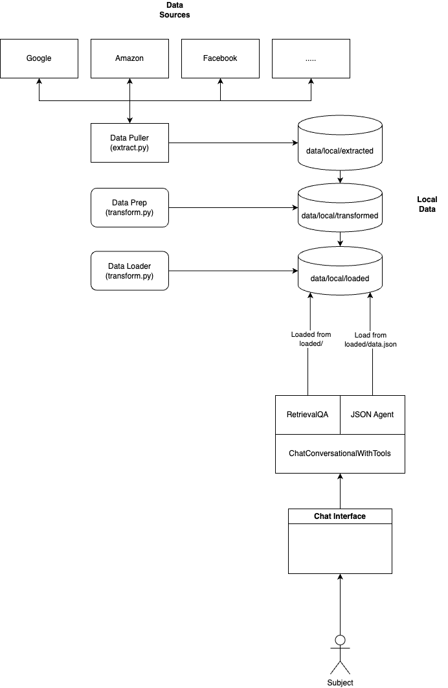

# Architecture

## Local Data Stack
The diagram below shows the high-level data flow from the data sources we pull personalization data from all the way to the agent that is using tools to using that data from structured for use locally.

## Current Architecture
The diagram below shows the current high-level architecture of data sources, scripts performing ETL functions, local data storage locations, and the Agent using tools to interact with that data.

